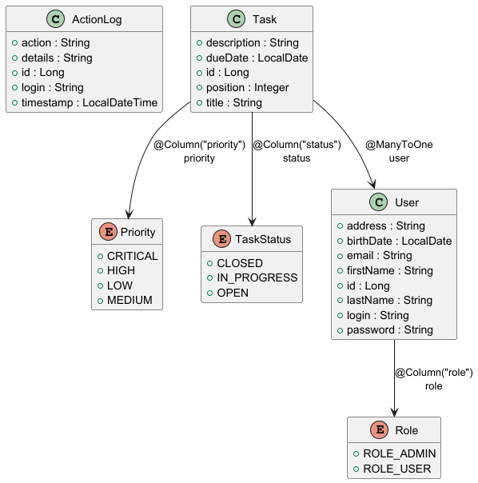

% Full-Stack-Entwicklung mit AI
% Jürg Good
% 11. Januar 2026

# Agenda

- Applikations-Demo (Angular, Android)
- AI-Werkzeuge (Junie AI, ChatGPT)
- Vorgehensweise & Praxisbeispiele
- Fazit & Ausblick

# Anwendungsübersicht

::::::::::::::: {.columns}
:::: {.column width="50%"}
- **Angular Web-UI**
  - [www.goodone.ch](https://www.goodone.ch)
  
::::
:::: {.column width="50%"}
- **Android App**
  
  - Direkte Installation via APK: [goodone.ch/android](https://www.goodone.ch/android)
::::
:::::::::::::::

# Architekturübersicht

- **Client 1**: Angular Web-UI
- **Client 2**: Android App (Jetpack Compose)
- **Client 3**: Test-Daten-Generator (Kotlin Console App)
- **API-Ebene**: Java, Spring Boot REST-API
- **Persistenz**: PostgreSQL (AWS RDS), Lokal: H2
- **Infrastruktur**: Docker Container auf AWS ECS Fargate

::: notes
Gefolgt von Online Demo
:::

# AI Toolset

::::::::::::::: {.columns}
:::: {.column width="50%"}
- **IntelliJ IDEA + Junie AI**: Backend & Frontend Kern.
- **Android Studio + Junie & Gemini AI**: Native mobile Entwicklung.
- **ChatGPT 5.x**: UX Design & Review (extern).
::::
:::: {.column width="50%"}

*Integrierte Entwicklungsumgebung*
::::
:::::::::::::::

# Vorgehen bei Design durch AI

- **Fast Prototyping**: Auftrag im AI-Fenster eingeben.
- **Beispiel**: "Entwickle eine Applikation mit Angular Frontend und Spring Boot Backend".
  - Definition von Entitäten, Attributen und Menüs.
- **AI-Planung**: Generierung eines detaillierten Vorgehens-Plans (Markdown).
- **Kontrolle**: Entwickler prüft und ergänzt den Plan.
- **Implementierung**: AI generiert Code und führt Tests aus.
- **Rolle des Entwicklers**: Fokus auf Planung, Kontrolle und Qualitätssicherung.
- **Ergebnis**: Minimaler manueller Code-Schreibaufwand.

# KI-gesteuerte Entwicklung mit Junie

- **Full-Stack Awareness**: Junie findet und modifiziert alle Projekt-Dateien.
- **Qualitätssicherung**: Automatisierte Unit-Test-Generierung (JUnit, Vitest).
- **Workflow**: Direkte Befehlsausführung (Build, Test) aus der IDE.
- **Effizienz**: Enorme Produktivitätssteigerung durch Kontext-Verständnis.

# ChatGPT

- **UX Design**: Unschlagbar bei Design-Vorschlägen und Layouts.
- **Review**: Kontinuierliche Verbesserungsvorschläge (Inhalt & Form).
- **Beispiel**: Inhaltlicher Review dieser Präsentation.
- **Einschränkung**: Fehlende IDE-Integration erschwert manuellen Datentransfer.

# Datenbankschema (ER-Diagramm)

- **Automatisierung**: Schema-Generierung und Design durch Junie.
- **Entitäten**: User, Task, Priority, TaskStatus.
- **Beziehungen**: Klare Definition der Datenstrukturen.
- **Migration**: Konsistente Verwaltung über Flyway.

# DB-Entwicklung für Android

- **Herausforderung**: Synchronisierung des Schemas (Backend vs. Mobile).
- **Prozess**: Entität ändern -> Junie generiert Flyway-SQL.
- **Automatisierung**: Junie aktualisiert Android Room-Skripte synchron.
- **Ergebnis**: Reibungslose Schema-Updates ohne manuelle Fehlerquellen.

# Einschränkungen im Firmenumfeld (Beispiel ZKB)

- **Sicherheit**: AI-Tools oft stark eingeschränkt oder blockiert.
- **Einschränkung**: Junie AI (direkter Code-Zugriff) oft nicht verfügbar.
- **Produktivitätsverlust**: Manueller Code-Transfer kostet viel Zeit.
- **Technologie-Gap**: Verwendung veralteter Modelle (z.B. GPT 4.x statt 5.x).

# Fazit

- **Qualität**: Robuste Applikationen durch vollständige Testabdeckung.
- **Effizienz**: Schnelle, inkrementelle Änderungen durch Junie.
- **Präzision**: Pläne werden treffergenau in Code umgesetzt.
- **Zukunft**: KI-gestützte Entwicklung ist ein absoluter Game-Changer.

## Schneller bauen mit Junie AI & ChatGPT.
