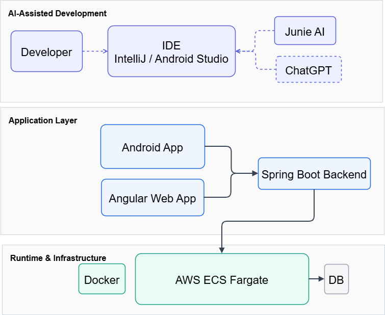

% Software-Entwicklung mit AI
% AI-gestützte Softwareentwicklung: von Idee zu Code, Tests und Doku
%

# Agenda
- **Demo & Kontext**
  - Angular Web & Android App
- **AI-Werkzeuge**
  - Junie AI, ChatGPT
- **Praxis**
  - Vorgehensweise & Beispiele
- **Einordnung**
  - Fazit & Ausblick

::: notes
Kurze Übersicht über den Ablauf der Präsentation.
Ziel ist es, erst Kontext und Demo zu zeigen,
dann die eingesetzten AI-Werkzeuge zu erklären
und zum Schluss Erfahrungen und eine Einordnung zu geben.
:::

# Anwendungsübersicht

::: columns
::: column

- **Angular Web-UI**
  - https://www.goodone.ch
:::

::: column

- **Android App**
  - APK Download: https://www.goodone.ch/android
:::
:::

::: notes
Die gleiche Anwendung existiert als Web- und als Android-App.
Beide greifen auf dasselbe Backend zu.
Das ist wichtig, weil AI-Unterstützung über alle Ebenen hinweg genutzt wurde.
:::

# Architekturübersicht – Infrastruktur

# AI unterstützte Entwicklung

# Architekturübersicht – Logisch
- **Clients**
  - Angular Web-UI
  - Android App (Jetpack Compose)
  - Test-Daten-Generator
- **Backend**
  - Java, Spring Boot REST-API
- **Persistenz**
  - PostgreSQL (AWS RDS)
  - Lokal: H2

::: notes
Hier sehen wir die logische Architektur.
Mehrere Clients greifen auf eine gemeinsame REST-API zu.
Die Persistenz ist produktiv PostgreSQL,
lokal wird H2 für Entwicklung und Tests genutzt.
:::

::: notes
Die Anwendung läuft containerisiert in AWS.
Docker ermöglicht reproduzierbare Builds,
ECS Fargate reduziert operativen Aufwand.
Nach dieser Folie folgt die Live-Demo.
:::

# AI Toolset
- **Junie AI (JetBrains)**
  - Code-Generierung, Refactoring, Tests
- **ChatGPT (OpenAI)**
  - UX-Design, Architektur-Reviews, Konzeptarbeit
- **IDE-Integration**
  - IntelliJ IDEA, Android Studio

::: notes
Wir nutzen nicht ein einzelnes Tool,
sondern eine Kombination.
Junie ist stark in der direkten Code-Arbeit in der IDE,
ChatGPT unterstützt eher konzeptionell und bei Reviews.
:::

# Vorgehen bei Design durch AI
1. **Prompting**
   - Ziel und Kontext definieren
2. **Struktur**
   - Entitäten, Attribute, Menüs
3. **Planung**
   - Detaillierter Markdown-Plan
4. **Review**
   - Entwickler prüft & ergänzt
5. **Implementierung**
   - Code + Tests durch AI
6. **Qualität**
   - Entwickler bleibt verantwortlich

::: notes
Wichtig ist ein strukturierter Ablauf.
AI arbeitet nicht „magisch“,
sondern folgt klaren Vorgaben.
Der Entwickler bleibt jederzeit verantwortlich
und prüft die Ergebnisse kritisch.
:::

# KI-gestützt mit Junie (IDE-zentriert)
- Direkte IDE-Integration
- Kontext aus Projekt & Code
- Schnelle Iterationen
- Fokus auf Implementierung

::: notes
Junie kennt den Projektkontext,
Dateien, Abhängigkeiten und Tests.
Das macht das Tool besonders effizient
für Implementierung, Refactoring und Tests.
:::

# ChatGPT (extern & beratend)
- Architektur- & UX-Feedback
- Alternative Lösungsansätze
- Formulierung & Dokumentation
- Kein direkter Code-Zugriff

::: notes
ChatGPT wird bewusst extern genutzt.
Es ist ideal für Reviews, Ideen und Formulierungen,
hat aber keinen direkten Zugriff auf den Code.
Das reduziert Risiken im Firmenumfeld.
:::

# Einschränkungen im Firmenumfeld
- **Security & Compliance**
  - Keine Kundendaten extern
- **Tool-Vorgaben**
  - Zentrale AI-Freigaben
- **Technologie-Gap**
  - Verzögerter Zugang zu aktuellen Modellen
- **Know-how**
  - Prompting-Kompetenz nötig

::: notes
Prompting-Kompetenz bedeutet:
AI liefert nur so gute Ergebnisse wie die Aufgabenstellung.
Gute Prompts erfordern Domänenwissen,
technisches Verständnis und klare Ziele.
AI ersetzt kein Know-how – sie verstärkt es.
:::

# Fazit
- **Demo bestätigt**: AI ist produktionsreif
- **Werkzeuge**: Junie & ChatGPT ergänzen sich ideal
- **Praxis**: Weniger Code, mehr Qualität
- **Ausblick**: AI-gestützte Entwicklung wird Standard

::: notes
Die Demo zeigt, dass AI heute produktiv eingesetzt werden kann.
Entscheidend ist die richtige Kombination von Werkzeugen
und die Einbettung in bestehende Entwicklungsprozesse.
:::

## Schneller bauen. Besser verstehen. Qualität sichern.
### Mit Junie AI & ChatGPT

::: notes
Abschliessende Kernbotschaft:
AI beschleunigt Entwicklung,
verbessert Qualität,
ersetzt aber nicht die Verantwortung des Entwicklers.
:::
