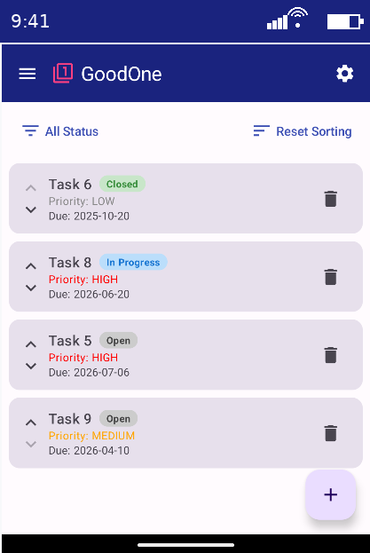

% Software-Entwicklung mit AI
% Von Idee zu Code, Tests, QA und Doku – mit Junie AI & ChatGPT
% Jürg Good · 19.1.2026

# Ziel & Takeaways

- **Was du siehst:** Web + Android App, gleiches Backend
- **Was du mitnimmst:**
  - AI beschleunigt Umsetzung und QA massiv
  - **Junie** = IDE-nah (Code/Test/Refactoring)
  - **ChatGPT** = Konzept/UX/Review/Doku
  - **Verantwortung bleibt beim Entwickler**

::: notes
Lächeln, freuen, Willkommen
Top aktuelles und interessantes Thema
Web App entwickelt mit aktuellsten KIs
Wie ist es dazu gekommen
Einführung KI für alle Entwickler im Herbst. Zur Kenntnis genommen. Reaktion eher verhalten
Nach Weihnachten: technische Neugierde gepackt, wegen Schneemangel Zeit. Seither mein privates Feierabend Projekt
Bin absolut fasziniert:
Entwicklung nach 30 Jahren Berufserfahrung auf Kopf gestellt innerhalb 6 Monate. Das Tool, welches ich verwende ist so alt.
Entwicklung rasant
Sämtliche händische Arbeit unnötig und Konzentration auf Wesentliche
Mein Knowhow 3.5 Wochen alt,
Sehr viel gelernt. Immer noch KI Neuling
Bei Fragen gleich melden. Viele Fenster offen. Melden falls ich beim falschen Fenster bin
Rückmeldung während des Meetings dankbar. Nicht dass ich in Offline Mikro plaudere
Disclaimer:
Normalerweise nicht do dominant platzieren
 alles KI generiert: keine Zeile Code geschrieben, Präsentation, Einladung, Nur ich kein Avatar
:::

# Agenda

- **Demo & Kontext** (GoodOne Web & Android)
- **AI-Werkzeuge** (Junie, ChatGPT, IDE-Setup)
- **Praxis** (Vorgehen, Prompting, Beispiele)
- **Einordnung** (Grenzen im Firmenumfeld, Fazit)

::: notes
Präsentation ca 45 Min
Grosser Demo Teil
Danach Diskussion
Input und Erfahrungen austauschen
Bereits kurzer Austausch mit Luciano
Follow up
:::

# Frontends

::: columns
::: column

:::
::: column

:::
:::

::: notes
Wichtig: zwei Clients, ein Backend. Das zeigt AI-Einsatz über mehrere Ebenen.
Applikation zun Selbstzweck. User kann einloggen und etwas klicken
Work in Progress
Admin View
Ihr dürft euch gerne registireren und einoggen
:::

# Erwartungen übertroffen

::: columns
::: column

:::
::: column

:::
:::

::: notes
„AI verstärkt Entwickler“.
Analogie Autofahren
Ursprünglich gelernt mit Kupplung, Schaltung. Auf Reise anhalten um Karte nachzuschauen
High Tech Mietauto. Nahezu autonom: Zieleingabe und los. Eingreifen nur falls Autosteuerung nicht OK, oder Parkassistent zu langsam
Nicht nur einfacher, sondern auch schneller am ziel
:::

# Initiale Aufgabe an die AI

- **Ziele**
  - Spring Boot Backend
  - Angular Frontend
  - Benutzerverwaltung (Profil + Login)

- **Erster Plan (AI-generiert)**
  - Projekte initialisieren (backend, frontend)
  - Entity/Repository + REST API (CRUD + Login)
  - Frontend Services + Login + Profilseite

::: notes
Wichtig: Der Start ist „ein sauberer Plan“. Danach iterativ: Review → Implement → Tests → Refactor.
Fokus: Nicht nur „Happy Path“, sondern Robustheit (Validierung, Security).
:::

# Demo: Was ich live zeige

- Produkt (www.goodone.ch)
- Code-Generierung & Iterationen in der IDE
- UI E2E Tests (Cypress) + Fixes
- Refactoring / Clean Code (Sonar/Qodana)
- Doku/Diagramme

::: notes
- www.goodone.ch
- Code-Generierung
- UI E2E Tests
- Refactoring
- Dokumentation
Live Demo. Fehler zeigen. 
Wenn Zeit knapp: Demo priorisieren: Feature-Change → Tests → QA → Merge-ready.
:::

# Architektur – Infrastruktur

::: notes
Containerisiert in AWS. Docker für reproduzierbare Builds, ECS Fargate reduziert Ops-Aufwand.
:::

# AI-unterstützte Entwicklung: Wo hilft was?

::: notes
Übergang: Von Architektur zu Arbeitsweise. Danach Toolset & Vorgehen.
:::

# AI Toolset

- **Junie AI (JetBrains)**
  - Code-Generierung, Refactoring, Tests direkt in IntelliJ/Android Studio
- **ChatGPT (OpenAI)**
  - UX-Design, Architektur-Reviews, Konzeptarbeit, Formulierungen
- **IDE-Integration**
  - Kontext aus Projektstruktur, Imports, Tests, Build-Logs

::: notes
Botschaft: Kombination statt „one tool to rule them all“.
:::

# Vorgehen: Design & Umsetzung mit AI

1. **Kontext + Ziel** (User Story, Screens, Constraints)
2. **Plan** (Schritte als Markdown-Checkliste)
3. **Implementierung** (kleine Iterationen, PR-fähig)
4. **Tests/QA** (Unit + E2E + Sonar)
5. **Review** (Mensch prüft Architektur, Security, Edge Cases)
6. **Stabilisieren** (Refactor, Naming, Doku)

::: notes
Explizit sagen: AI ist Teil des Prozesses, aber Qualitätssicherung bleibt menschlich.
Keine Magie. Sauberes Engineering.
:::

# Prompting-Beispiele

- **Implementierung**
  - Feature X inkl. Frontend, Backend, Migration, Tests
  - Android App mit identischen Features wie Web

- **Qualität & Fixes**
  - Behebe alle Sonar Findings
  - Refactor: bessere Testbarkeit, einheitliche Struktur

- **Testing**
  - Cypress E2E Tests, Coverage > 80%

- **DevOps & Doku**
  - User Guide, Architekturdiagramm
  - AWS Deployment

::: notes
Prompts funktionieren nur gut mit klarem Kontext,
Constraints und Definition of Done.
:::

# Junie (IDE-zentriert)
::: columns
::: column
- **Stark**, wenn der Code-Kontext entscheidend ist
  - Abhängigkeiten, Build-Fehler, Tests, Refactorings
- **Schnell**, weil Feedback Loop kurz ist
- **Ideal** für: Implementierung, Fixes, Testausbau

:::
::: column

:::
:::

::: notes
Hier die Stärke erklären: AI „sieht“ das Projekt direkt.
Live-Demo (IDE zeigen)
:::

# ChatGPT (extern & beratend)
::: columns
::: column
- **Stark**, wenn es um Alternativen/Reviews geht
  - Architektur/UX Feedback, Tradeoffs, Kommunikation
- **Ideal** für: Konzept, UX, Doku, Präsentationen
- **Achtung**: Kein direkter Code-Zugriff → Inputs präzise liefern

:::
::: column

:::
:::

::: notes
Im Firmenumfeld oft ein Vorteil: weniger Risiko, klar getrennt.
:::

# UX-Verbesserung durch ChatGPT

::: columns
::: column

:::
::: column

:::
:::

::: notes
Zeigen: AI kann UX iterativ verbessern – aber Entscheidung bleibt bei uns.
:::

# Resultat

- **Modernes UI** und konsistente UX
- **Aktueller Tech Stack** (Angular/Spring Boot/Android-Compose)
- **Hohe Code-Qualität** (Sonar/Qodana)
- **Automatisierte Tests** (Backend + UI E2E)
- **Automatisierte Pipelines** (Build/Test)
- **Erfahrung**: deutlich schneller als klassischer Ansatz (> Faktor 2)
- **Bonus**: schnellere Einarbeitung in neue Technologien

::: notes
Zahlen nur nennen, wenn du sie kurz begründen kannst („Vergleich Projekt 2020“).
:::

# Einschränkungen im Firmenumfeld

- **Security & Compliance**
  - Keine Kundendaten extern, Prompt-Sanitizing
- **Tool-Vorgaben**
  - Freigaben, Policies, On-Prem
- **Technologie-Gap**
  - Verzögerter Zugriff auf aktuelle Modelle/Features
- **Know-how**
  - Prompting-Kompetenz + Code Review bleibt Pflicht

::: notes
Prompting-Kompetenz = klare Ziele, Constraints, Definition of Done, Tests. 
AI verstärkt Know-how, ersetzt es nicht.
:::

# Fazit

- **AI ist produktiv**: stark bei Prototyp + QA + Refactoring
- **Junie + ChatGPT** ergänzen sich: Implementierung vs. Review/UX/Doku
- **Weniger Routine**, mehr Fokus auf Architektur & Qualität
- **Ausblick**: AI-gestützte Entwicklung wird Standard – Prozesse müssen mitziehen

::: notes
Schlussbotschaft: schneller bauen, besser verstehen, Qualität sichern.
Ein Satz, den man mitnimmt.
:::

## Schneller bauen. Besser verstehen. Qualität sichern.
### Mit Junie AI & ChatGPT

::: notes
Ein Satz, den man mitnimmt.
:::

# Impression

::: columns
::: column

:::
::: column

:::
:::

# Fragen

::: notes
Offen für Diskussion: Where to start? Welche Policies? Welche Quick Wins?
:::

# Anhang

# Links

- <https://www.goodone.ch>
- <https://github.com/JuergGood/angularai.git>
- <https://sonarcloud.io/summary/overall?id=JuergGood_angularai>

# Architektur – Logisch

- **Clients**
  - Angular Web-UI
  - Android App (Jetpack Compose)
  - Testdaten-Generator
- **Backend**
  - Java, Spring Boot REST API
- **Persistenz**
  - PostgreSQL (AWS RDS)
  - Lokal: H2

::: notes
Mehrere Clients greifen auf dieselbe REST API zu. Lokal bewusst leichtgewichtig.
:::

# QA Artefakte (Beispiele)

# Cypress Report

# Sonar Report

# Tech Stack & Umfang

::: columns
::: column
| Ebene | Technologien |
| :--- | :--- |
| **Backend** | Java 21, Spring Boot, JPA, Security, Maven |
| **Frontend** | Angular, TypeScript, Material, Signals |
| **Mobile** | Android (Jetpack Compose, Kotlin) |
| **DevOps** | Docker, AWS RDS/Fargate, SonarCloud |
:::
::: column
| Komponente | Dateien | Ca. LOC |
| :--- | :--- | :--- |
| **Backend** | 42 | ~2'400 |
| **Frontend** | 43+ | ~5'300 |
| **Android** | 147 | ~7'900 |
| **Total** | **~240+** | **~16'500+** |
:::
:::

::: notes
Wenn jemand fragt: LOC ist nur grober Indikator – wichtiger sind Tests/QA und Änderungsfähigkeit.
:::

# Qualitätssicherung (QA) KPIs

| Bereich | Werkzeuge | Metrik |
|:--|:--|:--|
| **Backend** | JUnit 5, Mockito, JaCoCo | ~82% Zeilen-Abdeckung |
| **Frontend** | Vitest, Cypress, NYC | ~81% Zeilen-Abdeckung |
| **Analyse** | SonarCloud, Qodana | Clean Code / A-Rating |
| **Automatisierung** | GitHub Actions | Automatisierter Build & Test |

::: notes
Hinweis: Abdeckung ist kein Selbstzweck – entscheidend sind kritische Pfade + stabile E2E Tests.
:::

# Management-Takeaway: AI in der Software-Entwicklung

- **Schneller**: Features, Fixes und QA in kürzerer Zeit
- **Besser**: Tests & Code-Qualität von Anfang an
- **Skalierbar**: Gleiches Vorgehen für Web & Mobile
- **Kontrolliert**: Entwickler entscheidet, AI unterstützt

::: notes
Kurzfassung für Management / Non-Dev (≈30–45s):
– AI ersetzt keine Entwickler
– AI reduziert Routinearbeit massiv
– Qualität steigt, weil Tests & Reviews günstiger werden
– Voraussetzung: klare Guidelines & Verantwortung im Team
:::

# Executive Summary – AI-gestützte Software-Entwicklung

- **Produktivität**: Deutlich schnellere Umsetzung von Features & Fixes
- **Qualität**: Tests und Code-Reviews von Beginn an integriert
- **Skalierung**: Gleiches Vorgehen für Web, Mobile & Backend
- **Risiko**: Entwickler behält Kontrolle, klare Leitplanken nötig
- **Empfehlung**: AI gezielt im Entwicklungsprozess verankern

::: notes
Kurzfassung für Entscheider (≈30s):

AI ist kein Selbstzweck.
Der Mehrwert entsteht durch:
– schnellere Iterationen
– frühere Qualitätssicherung
– bessere Nutzung von Entwicklerzeit

Empfehlung:
AI bewusst einführen, Guidelines definieren,
Pilotprojekte fördern.
:::
