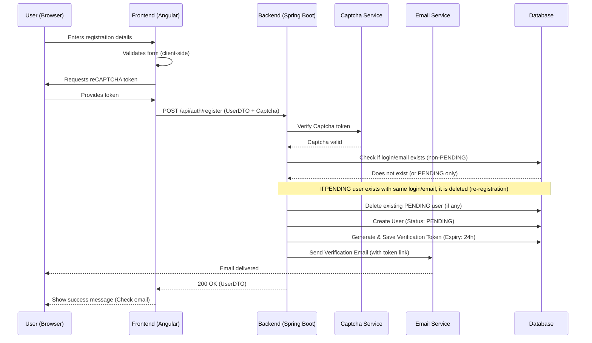
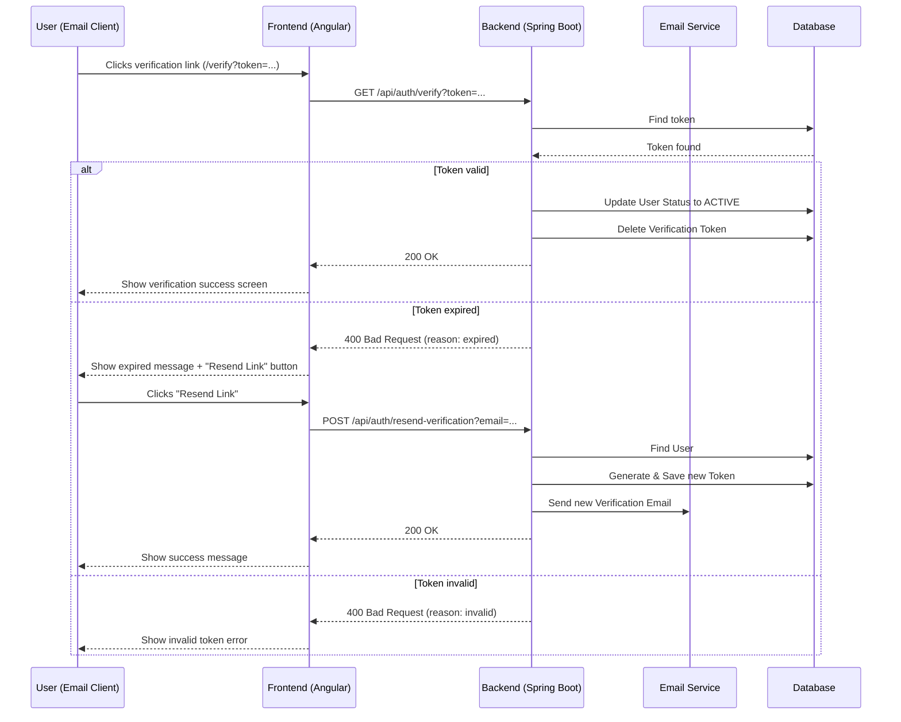
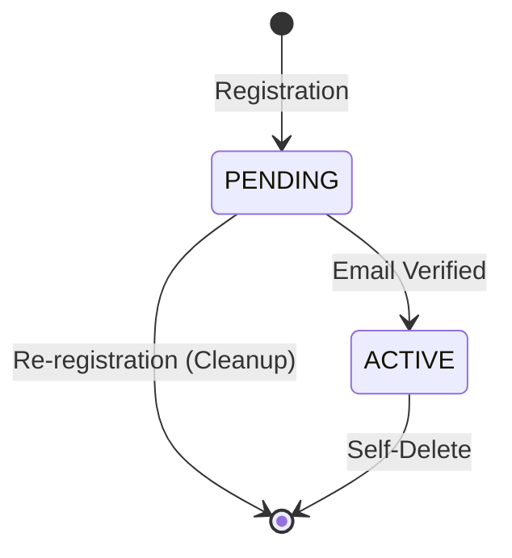
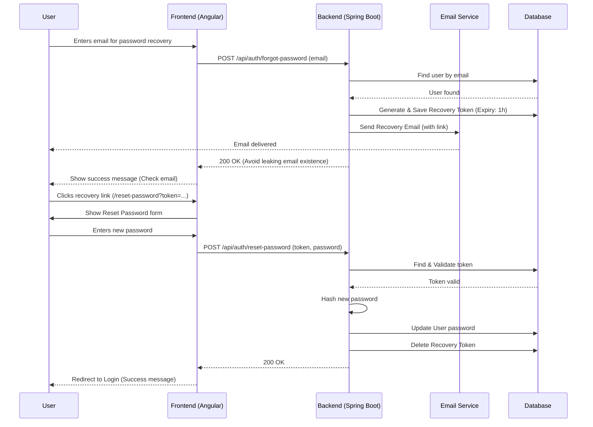
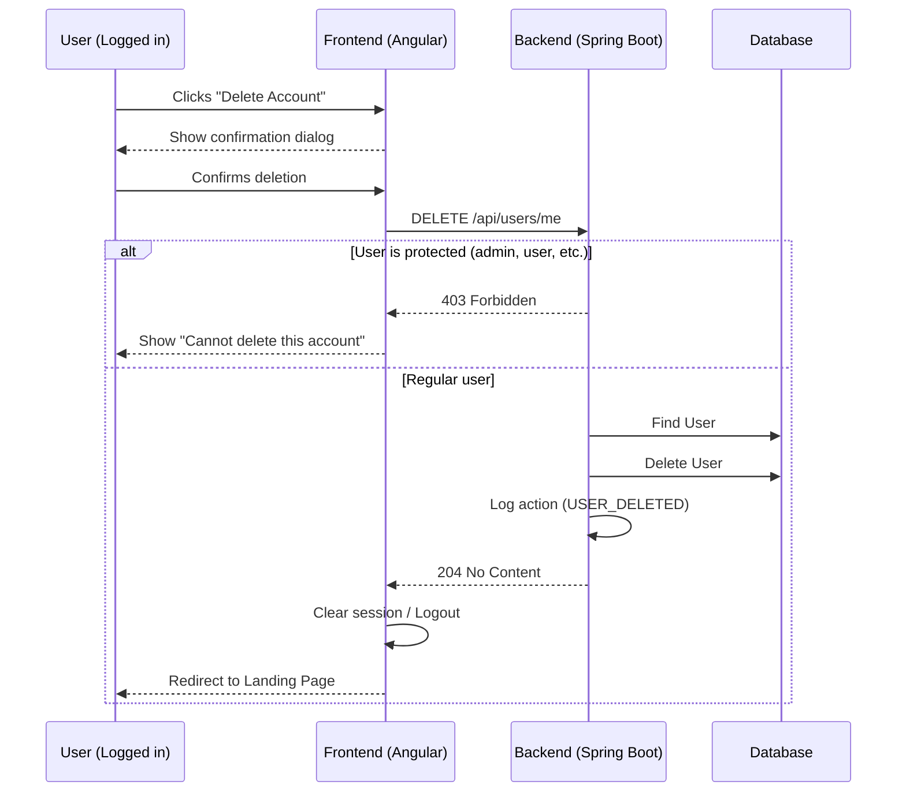

# User Workflows Documentation

This document describes the technical workflows for user management in the AngularAI project.

## 1. User Registration Workflow

The user registration process ensures that new users are verified via email and that the system is protected against automated registrations.

For a step-by-step visual guide with screenshots, see the [User Registration UI Guide](../../user-guide/workflows/registration-ui-guide.md).

### 1.1. Registration Sequence Diagram

### 1.2. Email Verification Sequence Diagram

### 1.3. User Status Transitions

---

## 2. Forgot Password Workflow

The forgot password workflow allows users to regain access to their account by resetting their password via a secure email link.

For a step-by-step visual guide with screenshots, see the [Forgot Password UI Guide](../../user-guide/workflows/forgot-password-ui-guide.md).

### 2.1. Forgot Password Sequence Diagram

---

## 3. User Self-Delete Workflow

Users have the right to delete their own account. Certain system accounts are protected.

### 3.1. Self-Delete Sequence Diagram

