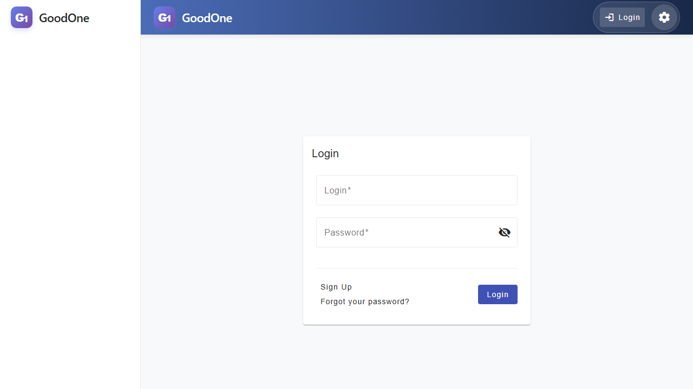
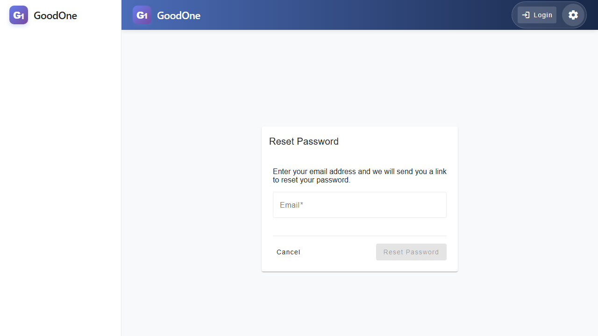
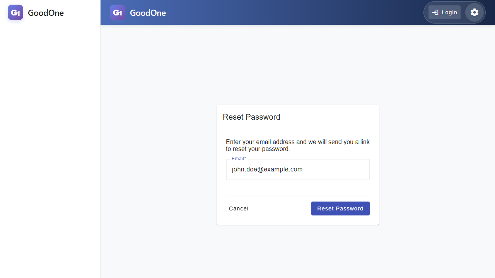
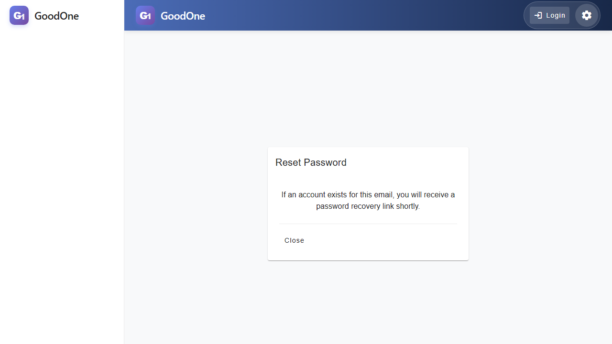
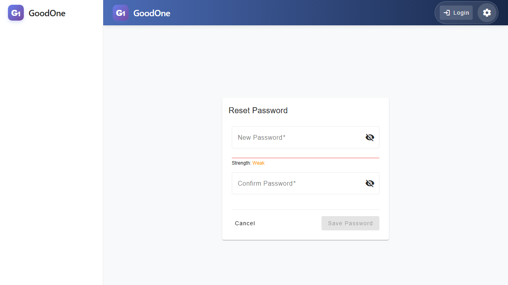
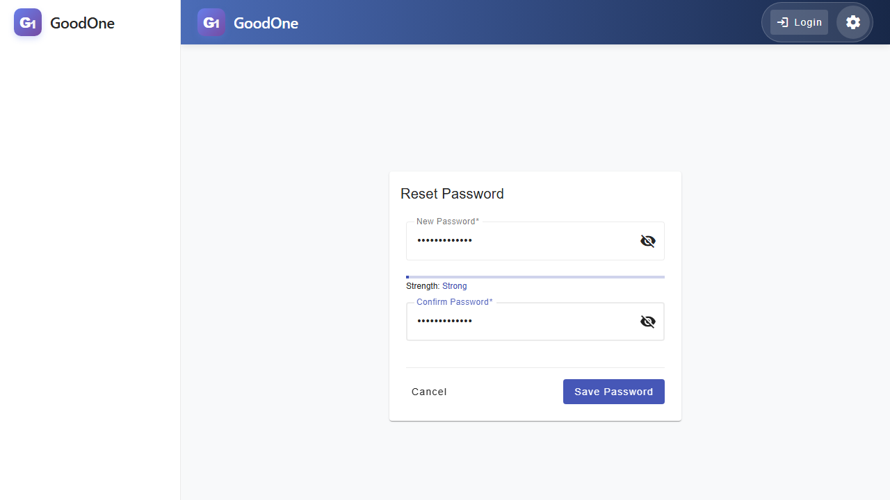
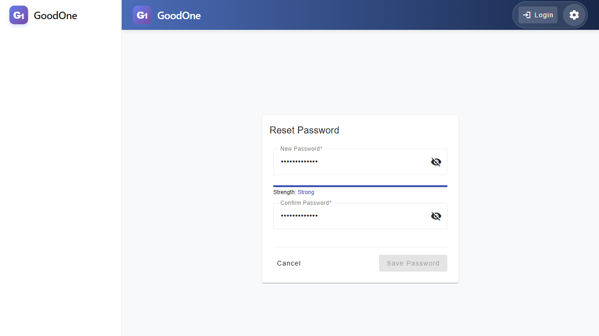

# Forgot Password & Reset Guide

This guide walks you through the process of recovering your account if you have forgotten your password.

## Step 1: Initiating Password Recovery

If you cannot remember your password, go to the login page and click on the **"Forgot your password?"** link.

## Step 2: Requesting a Reset Link

Enter the email address associated with your account in the forgot password form and click **"Reset Password"**.

Once you enter your email, the button will be enabled.

## Step 3: Confirmation Message

After submitting your email, you will see a confirmation message. For security reasons, the system does not disclose whether the email address exists in our database.

## Step 4: Check Your Email

Check your inbox for a password recovery email. It contains a secure link that is valid for 1 hour. Click the link to be redirected to the password reset page.

## Step 5: Setting a New Password

On the reset password page, enter your new password twice to confirm it.

The system includes a strength indicator to help you choose a secure password. Both fields must match for the **"Save Password"** button to be enabled.

## Step 6: Success

Once you have successfully reset your password, you will see a confirmation message. You can now return to the login page and sign in with your new password.

