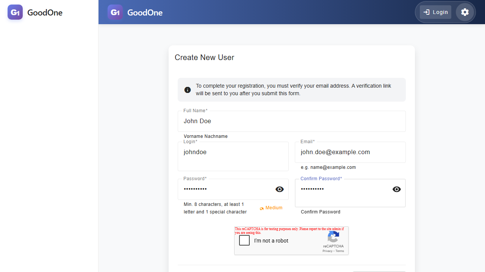
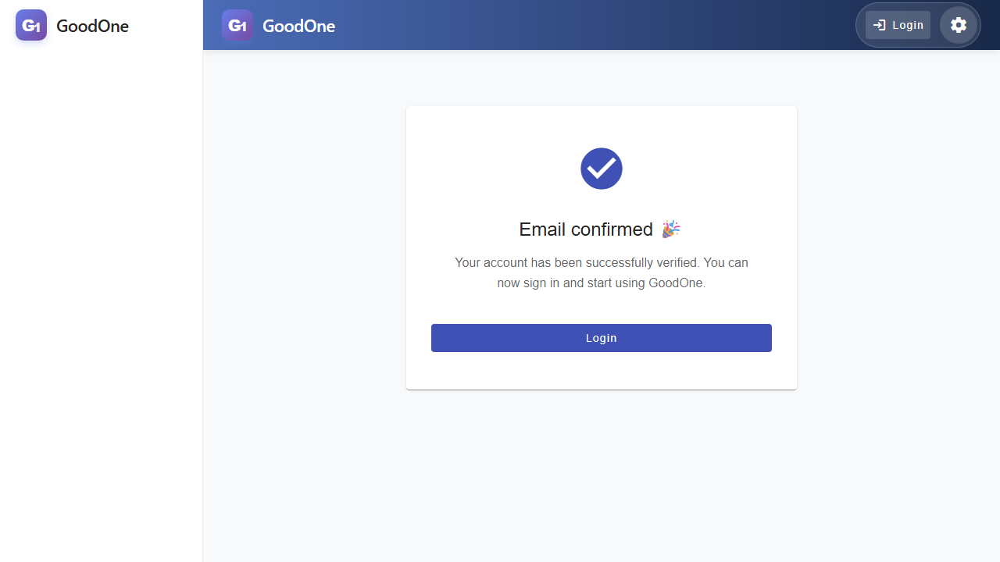
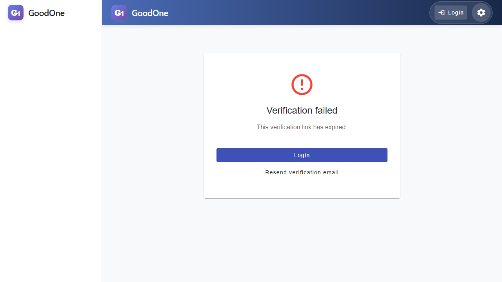

# User Registration Guide

This guide walks you through the process of creating a new account in the AngularAI system.

## Step 1: Accessing the Registration Page

Starting from the login page, click on the **"Sign up"** button to go to the registration form.

## Step 2: Filling the Registration Form

Enter your details in the registration form. All fields are required.

- **Full Name**: Enter your first and last name.
- **Login**: Choose a unique username (no spaces allowed).
- **Email**: Enter a valid email address where you will receive the verification link.
- **Password**: Choose a strong password that meets the security requirements.
- **Security Check**: Complete the "I'm not a robot" (reCAPTCHA) verification.

Once all fields are correctly filled and the security check is completed, the **"Sign up"** button will be enabled.

## Step 3: Account Created

After clicking **"Sign up"**, you will see a success message. At this point, your account is created but is still in a **PENDING** state. You must verify your email address to activate it.

## Step 4: Email Verification

Check your inbox for a verification email. Click the link provided in the email to activate your account. If successful, you will see the following confirmation:

### Troubleshooting: Expired Link

Verification links are valid for 24 hours. If your link has expired, you will see an error page. You can request a new verification link by clicking the **"Resend Verification Link"** button.

Once verified, you can proceed to the login page and start using the application!
