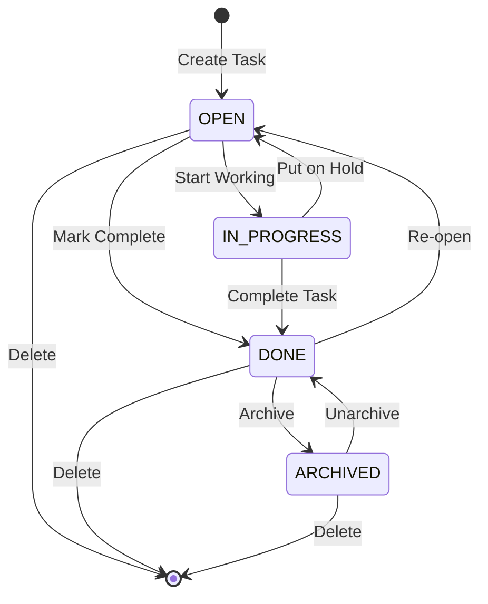
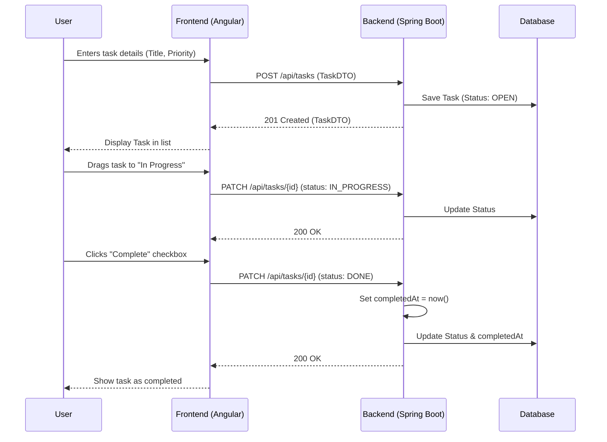

# Task Workflows Documentation

This document describes the `Task` object, its attributes, and the workflows associated with task management in the AngularAI project.

## 1. Task Object Model

The `Task` object is the central entity for user-defined activities.

### 1.1. Main Attributes

| Attribute | Type | Description |
| :--- | :--- | :--- |
| `id` | `Long` / `number` | Unique identifier (Server-generated) |
| `title` | `String` | Brief summary of the task |
| `description` | `String` | Detailed description (up to 1000 characters) |
| `dueDate` | `LocalDate` / `string` | Target completion date (YYYY-MM-DD) |
| `priority` | `Enum` | Priority level: `LOW`, `MEDIUM`, `HIGH`, `CRITICAL` |
| `status` | `Enum` | Current state: `OPEN`, `IN_PROGRESS`, `DONE`, `ARCHIVED` |
| `position` | `Integer` | Vertical position for drag-and-drop ordering |
| `tags` | `List<String>` | Collection of labels for categorization |
| `createdAt` | `LocalDateTime` | Timestamp of creation (Read-only) |
| `updatedAt` | `LocalDateTime` | Timestamp of last modification (Read-only) |
| `completedAt`| `LocalDateTime` | Timestamp when status was set to `DONE` (Read-only) |

---

## 2. Task State Management

Tasks follow a defined lifecycle managed by the `status` attribute.

### 2.1. State Transitions

---

## 3. User Actions

The following actions can be performed by the user to modify task states:

### 3.1. CRUD Operations

*   **Create**: Initializes a new task. Status defaults to `OPEN`.
*   **Update**: Full update of all task attributes (via `PUT`).
*   **Patch**: Partial update of specific attributes (e.g., updating only the `status` or `priority`).
*   **Delete**: Permanent removal of the task from the system.

### 3.2. Specialized Actions

*   **Reorder**: Updates the `position` attribute via drag-and-drop in the UI.
*   **Bulk Operations**:
    *   **Bulk Patch**: Update attributes (like status or priority) for multiple tasks at once.
    *   **Bulk Delete**: Remove multiple tasks in a single operation.
*   **Smart Filter / Analysis**: Users can use natural language to "analyze" a task string, which the backend parses into structured task data.

---

## 4. Task Lifecycle Sequence Diagram

