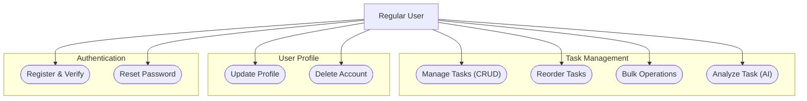
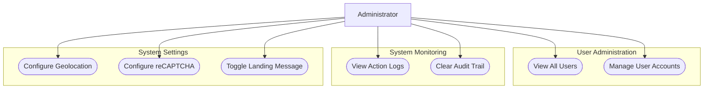

# Use Case Documentation

This document describes the primary use cases for the AngularAI system, categorized by user roles: **Regular User** and **Administrator**.

## 1. User Use Cases

The following diagram illustrates the key actions a regular user can perform within the system.

### 1.1. Description of User Use Cases

*   **Manage Tasks (CRUD)**: Create, read, update, and delete individual tasks. This includes setting titles, descriptions, priorities, and due dates.
*   **Reorder Tasks**: Organize the task list using drag-and-drop, which persists the vertical position on the server.
*   **Bulk Operations**: Apply changes (like status updates or deletion) to multiple selected tasks simultaneously to save time.
*   **Analyze Task (AI)**: Use natural language to describe a task; the system parses the input using AI to automatically fill in structured data like title and priority.
*   **Update Profile**: Manage personal information such as first name, last name, email address, and physical address.
*   **Delete Account**: Self-service option to permanently remove the user's account and all associated data from the system.
*   **Register & Verify**: Create a new account and complete the email verification process (protected by reCAPTCHA).
*   **Reset Password**: Recover account access via a secure email link if the password is forgotten.

---

## 2. Admin Use Cases

Administrators have elevated privileges to manage the system, its users, and monitor activities.

### 2.1. Description of Admin Use Cases

*   **View All Users**: Access a comprehensive list of all registered users in the system.
*   **Manage User Accounts**: Create new users manually, update existing user details (including roles), or delete accounts (with self-protection to prevent accidental lockout).
*   **View Action Logs**: Monitor a detailed audit trail of significant system events and user actions (filtered by type or date).
*   **Clear Audit Trail**: Maintenance function to purge old action logs from the database.
*   **Configure Geolocation**: Enable or disable the IP-based geolocation service and test IP lookups.
*   **Configure reCAPTCHA**: Switch between different reCAPTCHA configurations or sensitivity levels.
*   **Toggle Landing Message**: Control the visibility of the global landing page message for all users.
